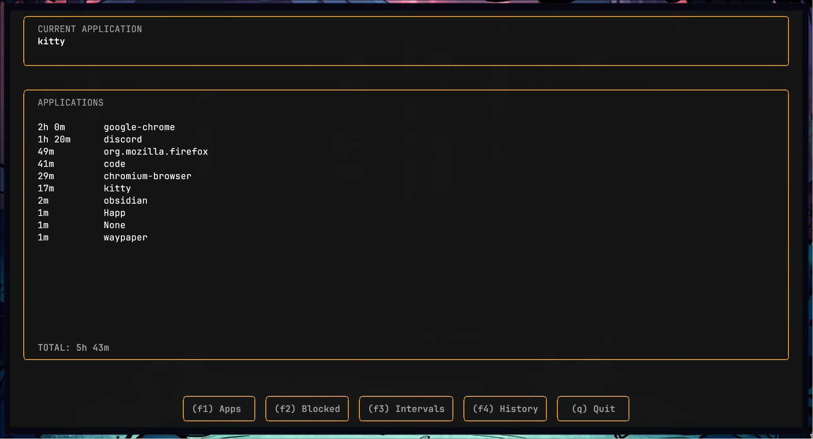
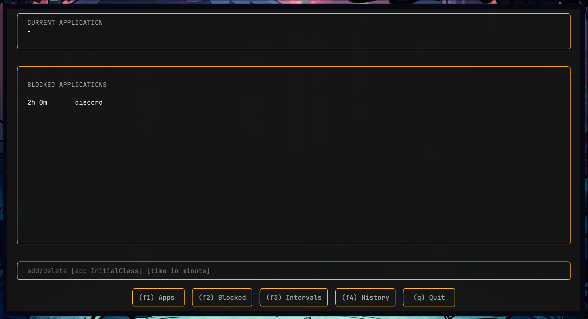
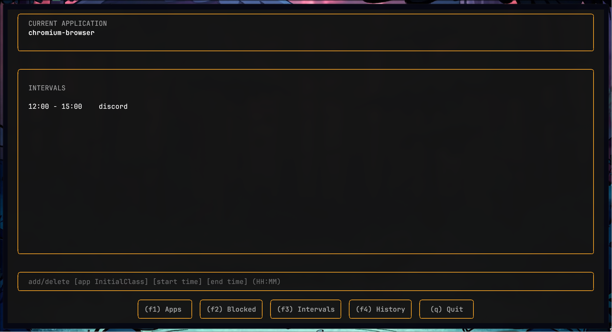
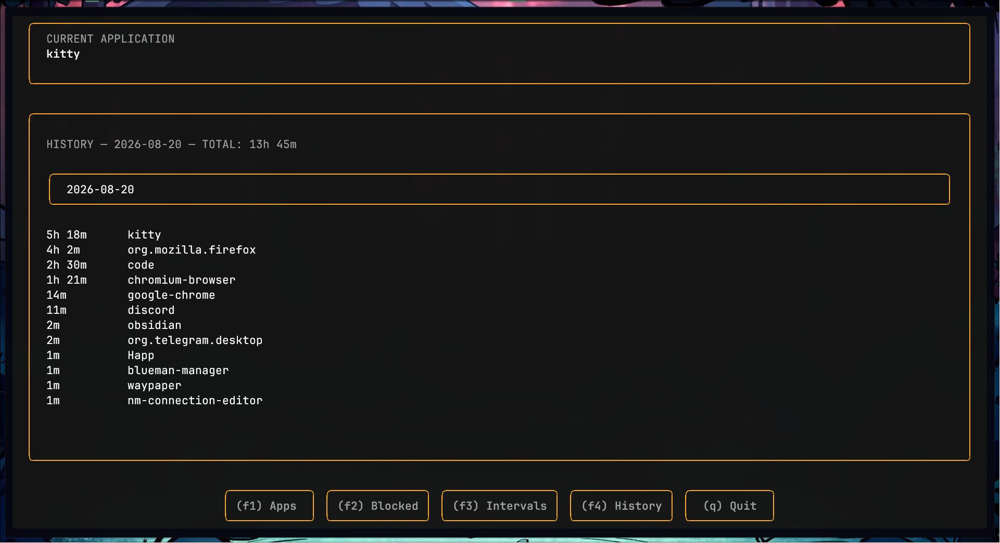

Use the `norn app` command to launch the TUI.

From this TUI, you can add apps to block or view the apps that were active today or on previous days

Go to the “block” section to add apps that will remain active until the active time exceeds the value you specified. The input format is [app initialClass] [time], the app's name is its `initialClass`, which you can view using `hyprctl clients` or `hyprctl activewindow`,and the time is specified in minutes.

Go to “Interval” to add apps that will remain active until they fall within the time range you specify. You can set the time range the same way as for “Block,” but now you need to specify two different times: [app initialClass] [start time] [end time].
Times must be entered in the HH:MM format.

Go to “History” to see which apps were active on specific days. Enter the date in the format YYYY-MM-DD 

You can also view app activity and set restrictions via the terminal; you'll know which commands to use if you run `norn -h`.